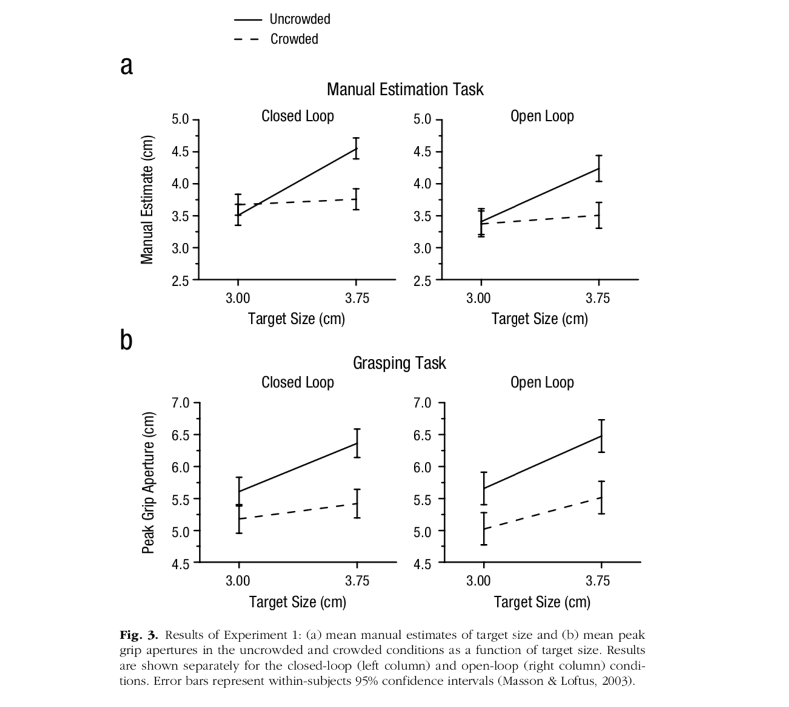

# Report Details

```{r}
articleID <- 6-1-2015 # insert the article ID code here e.g., "10-3-2015"
reportType <- "pilot" # specify whether this is the 'pilot' report or 'copilot' report
pilotNames <- "Kayla Good" # insert the pilot's name here e.g., "Tom Hardwicke".
copilotNames <- "Ashish Mehta" # # insert the co-pilot's name here e.g., "Michael Frank".
pilotTTC <- NA # insert the pilot's estimated time to complete (in minutes, it is fine to approximate) e.g., 120
copilotTTC <- NA # insert the co-pilot's estimated time to complete (in minutes, it is fine to approximate) e.g., 120
pilotStartDate <- as.Date("11/2/19", format = "%m/%d/%y") # insert the piloting start date in US format e.g., as.Date("01/25/18", format = "%m/%d/%y")
copilotStartDate <- NA # insert the co-piloting start date in US format e.g., as.Date("01/25/18", format = "%m/%d/%y")
completionDate <- NA # insert the date of final report completion in US format e.g., as.Date("01/25/18", format = "%m/%d/%y")
```

------

Link to GitHub repository: https://github.com/kagood/reproducibility_assignment

#### Methods summary: 

Experiment 1 of Chen et al. (2015) aimed to examine whether the "crowding effect," or the interfering effect of flankers on one's perception of a target object located in the periphery of their visual field, also influences one's actions oriented toward that target. Participants were run through a series of trials in which they were visually presented with a target object on a display. Once participants hit a start button, their view of the display was occluded, either immediately (closed-loop condition) or after 3 seconds (open-loop condition). They were asked to either estimate the size of the object (manual estimation condition) or grasp the object (grasping condition). 

Across trials, the experimenters also varied whether the target object was presented with (crowded condition) or without (uncrowded condition) flankers as well as the size of the target object (either 3cm or 3.75cm). All variables were manipulated within-subjects, generating a 2 (viewing condition: closed or open-loop) X 2 (task: estimate or grasp) X 2(crowding condition: crowded or uncrowded) X 2 (target size: 3cm or 3.75cm) design. The primary outcome variable was participants' estimation of the size of the target in manual estimation trials and their peak grip aperture (PGA) on grasping trials.

------

#### Target outcomes: 

For this article you should focus on the findings reported in section "Effects of crowding on perception and action" for Experiment 1.

Specifically, you should attempt to reproduce all descriptive and inferential analyses reported in the text below and associated tables/figures:

> Effects of crowding on perception and action

> Experiment 1 was designed to explore the effects of crowding on perception and action, with a particular focus on whether participants could scale their grip aperture to the size of the target even when they could not consciously identify the size of the target. We carried out a four-way repeated measures ANOVA on the manual estimates and PGAs with task (estimation vs. grasping), crowding condition (uncrowded vs. crowded), viewing condition (closed- vs. open-loop), and target size (3.0 vs. 3.75 cm) as main factors. The significant interaction between task and crowding condition, F(1, 9) = 6.818, p = .028, suggested that crowding had different effects on performance of the grasping and manual estimation tasks. Not surprisingly, when the target was presented in isolation, participants were able to manually estimate the sizes of the two targets—and this was true for both closed-loop trials, t(9) = 7.23, p < .001, and open-loop trials, t(9) = 9.19, p < .001. Similarly, participants showed excellent grip scaling for targets presented in isolation on both closed-loop trials, t(9) = 4.29, p = .002, and openloop trials, t(9) = 4.79, p = .001 (Fig. 3). Things were quite different, however, when the target disks were surrounded by flankers. In this condition, participants could no longer discriminate between the two disk sizes using a manual estimate closed-loop trials: t(9) = 1.02, p = .334; open-loop trials: t(9) = 1.78, p = .108?presumably because the size of the target was perceptually invisible. (Note that we use the term invisible to refer to the fact that participants could not identify the size of the target, even though they were aware of its presence and position.) In contrast, when participants were asked to grasp the same targets, their PGAs were still scaled to target size?closed-loop trials: t(9) = 4.21, p = .002; open-loop trials: t(9) = 3.392, p = .008 (Fig. 3).

------

```{r global_options, include=FALSE}
# sets up some formatting options for the R Markdown document
knitr::opts_chunk$set(echo=TRUE, warning=FALSE, message=FALSE)
```

# Step 1: Load packages and prepare report object

```{r}
# load packages
library(tidyverse) # for data munging
library(knitr) # for kable table formating
library(haven) # import and export 'SPSS', 'Stata' and 'SAS' Files
library(readxl) # import excel files
library(ReproReports) # custom reporting functions
library(broom) # for creating tidy output for statistical analyses
```

```{r}
# Prepare report object. This will be updated automatically by the reproCheck function each time values are compared
reportObject <- data.frame(dummyRow = TRUE, reportedValue = NA, obtainedValue = NA, valueType = NA, percentageError = NA, comparisonOutcome = NA, eyeballCheck = NA)
```

# Step 2: Load data

Experiment 1 data was extracted from the "summary" sheet of the "data_Exp1.xlsx" file.

```{r}
# Read in data from "summary" sheet of Exp. 1 Excel file and save to new dataframe
raw_data <- read_xlsx("GroupA_6-1-2015/data/data_Exp1.xlsx", sheet = "summary")
```

# Step 3: Tidy data

The data were re-organized to a wide format (for tidying in a subsequent step) with appropriate headers for each combination of conditions.

One important thing to note is that, in the original data file, the manual estimates for the open-loop condition were listed under the following headings: "un5", "un8", "crd5", and "crd8". The paper indicated that the same target sizes (3cm and 3.75cm) were used across conditions. "Un" and "crd" clearly correspond to the "uncrowded" and "crowded" conditions, but it was assumed that "5" and "8" correspond to "3cm" and "3.75cm," respectively.

```{r}
  
clean_data_wide_withmeans <- raw_data %>%
  filter(grepl('sub', ...1) | grepl('mean', ...1)) %>% # removes unnecessary row with condition labels
  filter(!(...1 == "sub")) %>% # removes unnecessary row with condition labels
  rename("SubID" = "...1", 
         "closedloop_grasp_uncrowded_3cm" = "closed-loop grasping",
         "closedloop_grasp_uncrowded_3.75cm" = "...3", 
         "closedloop_grasp_crowded_3cm" = "...4", 
         "closedloop_grasp_crowded_3.75cm" = "...5", 
         "openloop_grasp_uncrowded_3cm" = "open-loop_grasping", 
         "openloop_grasp_uncrowded_3.75cm" = "...8", 
         "openloop_grasp_crowded_3cm" = "...9", 
         "openloop_grasp_crowded_3.75cm" = "...10", 
         "closedloop_estimate_uncrowded_3cm" = "closed-loop estimation",
         "closedloop_estimate_uncrowded_3.75cm" = "...13", 
         "closedloop_estimate_crowded_3cm" = "...14", 
         "closedloop_estimate_crowded_3.75cm" = "...15", 
         "openloop_estimate_uncrowded_3cm" = "open-loop estimation",
         "openloop_estimate_uncrowded_3.75cm" = "...18",
         "openloop_estimate_crowded_3cm" = "...19",
         "openloop_estimate_crowded_3.75cm" = "...20") %>% # Renaming the columns to reflect each subject's score by crowding condition, viewing condition, task, and target size  
   select(-c(...6, ...11, ...16)) # removes columns used for spacing in original Excel file
```

All of the columns read in from Excel were assigned the "character" data type by R. Therefore, the columns containing scores (either estimates or PGAs) were converted to numeric.

```{r}
i <- c(2:17)
clean_data_wide_withmeans[,i] <- apply(clean_data_wide_withmeans[,i], 2, as.numeric) # converting appropriate columns to numeric data type
```

The original data file contained a row with group means; however, in order to calculate these means from the data, a new dataframe was created that contained just individual subjects' data.

```{r}
clean_data_wide_withoutmeans <- clean_data_wide_withmeans %>% 
  slice(1:10) # slicing out column with condition means so that just the individual subjects' scores remain
```

Both dataframes (one with and one without group means) were converted to long or 'tidy' format.

```{r}
clean_data_long_withmeans <- clean_data_wide_withmeans %>% 
  pivot_longer(-SubID, 
               names_to = "condition", 
               values_to = "score") %>% 
  separate(condition, into=c("viewing_condition", "task", "crowding_condition", "target_size"),
               sep="_") %>% 
             select(viewing_condition, task, crowding_condition, target_size, everything()) # pivots data into 'tidy' or 'long' format, with columns to indicate levels of each condition
```

```{r}
clean_data_long_withoutmeans <- clean_data_long_withmeans %>% 
  filter(SubID != "mean") # removing means from data frame
```


# Step 4: Run analysis

## Pre-processing

A data frame was created that contained the means provided in the original Excel file.

```{r}
means_from_original_data_long <- clean_data_long_withmeans %>% 
  filter(SubID == "mean") # extracting means reported in original data file
```

A data frame was created that calculated the means from the individual subjects' data.

```{r}
calculated_means <- clean_data_long_withoutmeans %>% 
  group_by(viewing_condition, task, crowding_condition, target_size) %>% 
  summarise(mean = mean(score),
            sd = sd(score),
            se = sd(score)/sqrt(length(score))) %>% 
  ungroup() # calculates the 16 means that result from every combination of the four conditions 
```

Means for only manual estimation were extracted into a new dataframe. The target size and crowding condition variables were releveled (for the purpose of creating plots later).

```{r}
manual_estimation_means <- calculated_means %>% 
  filter(task == "estimate") # creates a new dataframe with just means from manual estimation task

manual_estimation_means$target_size <- as.factor(manual_estimation_means$target_size)
manual_estimation_means$target_size <- relevel(manual_estimation_means$target_size, ref = "3cm") # relevels target size so that 3cm is listed first

manual_estimation_means$crowding_condition <- as.factor(manual_estimation_means$crowding_condition)
manual_estimation_means$crowding_condition <- relevel(manual_estimation_means$crowding_condition, ref = "uncrowded") # relevels target size so that uncrowded is listed first
```

The same procedure was carried out for the grasping task means.

```{r}
grasping_means <- calculated_means %>% 
  filter(task == "grasp") # creates a new dataframe with just means from grapsing task

grasping_means$target_size <- as.factor(grasping_means$target_size)
grasping_means$target_size <- relevel(grasping_means$target_size, ref = "3cm") # relevels target size so that 3cm is listed first

grasping_means$crowding_condition <- as.factor(grasping_means$crowding_condition)
grasping_means$crowding_condition <- relevel(grasping_means$crowding_condition, ref = "uncrowded") # relevels target size so that uncrowded is listed first
```

Data frames were created that contained individual subjects' data for each target size (3cm and 3.75cm) within each combination of the other three conditions (viewing condition, crowding condition, and task). These were created for the purpose of t-tests.

```{r}
t_test_closedloop_estimate_uncrowded_data <- clean_data_long_withoutmeans %>% 
  filter(viewing_condition == "closedloop" & 
           task == "estimate" & 
           crowding_condition == "uncrowded") # creates dataframe containing individual subjects' estimates for 3cm and 3.75cm targets in the closed-loop, uncrowded condition

t_test_openloop_estimate_uncrowded_data <- clean_data_long_withoutmeans %>% 
  filter(viewing_condition == "openloop" & 
           task == "estimate" & 
           crowding_condition == "uncrowded") # creates dataframe containing individual subjects' estimates for 3cm and 3.75cm targets in the open-loop, uncrowded condition

t_test_closedloop_grasp_uncrowded_data <- clean_data_long_withoutmeans %>% 
  filter(viewing_condition == "closedloop" & 
           task == "grasp" & 
           crowding_condition == "uncrowded") # creates dataframe containing individual subjects' PGAs for 3cm and 3.75cm targets in the closed-loop, uncrowded condition

t_test_openloop_grasp_uncrowded_data <- clean_data_long_withoutmeans %>% 
  filter(viewing_condition == "openloop" & 
           task == "grasp" & 
           crowding_condition == "uncrowded") # creates dataframe containing individual subjects' PGAs for 3cm and 3.75cm targets in the open-loop, uncrowded condition

t_test_closedloop_estimate_crowded_data <- clean_data_long_withoutmeans %>% 
  filter(viewing_condition == "closedloop" & 
           task == "estimate" & 
           crowding_condition == "crowded") # creates dataframe containing individual subjects' estimates for 3cm and 3.75cm targets in the closed-loop, crowded condition

t_test_openloop_estimate_crowded_data <- clean_data_long_withoutmeans %>% 
  filter(viewing_condition == "openloop" & 
           task == "estimate" & 
           crowding_condition == "crowded") # creates dataframe containing individual subjects' estimates for 3cm and 3.75cm targets in the open-loop, crowded condition

t_test_closedloop_grasp_crowded_data <- clean_data_long_withoutmeans %>% 
  filter(viewing_condition == "closedloop" & 
           task == "grasp" & 
           crowding_condition == "crowded") # creates dataframe containing individual subjects' PGAs for 3cm and 3.75cm targets in the closed-loop, crowded condition

t_test_openloop_grasp_crowded_data <- clean_data_long_withoutmeans %>% 
  filter(viewing_condition == "openloop" & 
           task == "grasp" & 
           crowding_condition == "crowded") # creates dataframe containing individual subjects' PGAs for 3cm and 3.75cm targets in the open-loop, crowded condition
```

## Descriptive statistics

The number of participants listed in the Excel file provided was calculated and compared to the total number reported in the paper.

```{r}
number_of_participants_calculated <- nrow(clean_data_wide_withoutmeans)

reportObject <- reproCheck(reportedValue = '10', obtainedValue = number_of_participants_calculated, valueType = 'n', eyeballCheck = NA)
```

Next, the means for each combination of the four conditions were calculated and compared to the values reported in the original Excel file.

```{r}
mean_closedloop_estimate_crowded_3cm <- manual_estimation_means$mean[2] # calculates mean for viewing: closed loop, task: estimate, crowding: crowded, target size: 3cm

reportObject <- reproCheck(reportedValue = '3.671622', obtainedValue = mean_closedloop_estimate_crowded_3cm, valueType = 'mean', eyeballCheck = NA)
```

```{r}
mean_closedloop_estimate_crowded_3.75cm <- manual_estimation_means$mean[1] # calculates mean for viewing: closed loop, task: estimate, crowding: crowded, target size: 3.75cm

reportObject <- reproCheck(reportedValue = '3.758122', obtainedValue = mean_closedloop_estimate_crowded_3.75cm, valueType = 'mean', eyeballCheck = NA)
```

```{r}
mean_closedloop_estimate_uncrowded_3cm <- manual_estimation_means$mean[4] # calculates mean for viewing: closed loop, task: estimate, crowding: uncrowded, target size: 3cm

reportObject <- reproCheck(reportedValue = '3.514225', obtainedValue = mean_closedloop_estimate_uncrowded_3cm, valueType = 'mean', eyeballCheck = NA)
```

```{r}
mean_closedloop_estimate_uncrowded_3.75cm <- manual_estimation_means$mean[3] # calculates mean for viewing: closed loop, task: estimate, crowding: uncrowded, target size: 3.75cm

reportObject <- reproCheck(reportedValue = '4.553233', obtainedValue = mean_closedloop_estimate_uncrowded_3.75cm, valueType = 'mean', eyeballCheck = NA)
```

```{r}
mean_openloop_estimate_crowded_3cm <- manual_estimation_means$mean[6] # calculates mean for viewing: open loop, task: estimate, crowding: crowded, target size: 3cm

reportObject <- reproCheck(reportedValue = '3.372486', obtainedValue = mean_openloop_estimate_crowded_3cm, valueType = 'mean', eyeballCheck = NA)
```

```{r}
mean_openloop_estimate_crowded_3.75cm <- manual_estimation_means$mean[5] # calculates mean for viewing: open loop, task: estimate, crowding: crowded, target size: 3.75cm

reportObject <- reproCheck(reportedValue = '3.506522', obtainedValue = mean_openloop_estimate_crowded_3.75cm, valueType = 'mean', eyeballCheck = NA)
```

```{r}
mean_openloop_estimate_uncrowded_3cm <- manual_estimation_means$mean[8] # calculates mean for viewing: open loop, task: estimate, crowding: uncrowded, target size: 3cm

reportObject <- reproCheck(reportedValue = '3.392611', obtainedValue = mean_openloop_estimate_uncrowded_3cm, valueType = 'mean', eyeballCheck = NA)
```

```{r}
mean_openloop_estimate_uncrowded_3.75cm <- manual_estimation_means$mean[7] # calculates mean for viewing: open loop, task: estimate, crowding: uncrowded, target size: 3.75cm

reportObject <- reproCheck(reportedValue = '4.238756', obtainedValue = mean_openloop_estimate_uncrowded_3.75cm, valueType = 'mean', eyeballCheck = NA)
```

```{r}
mean_closedloop_grasp_crowded_3.75cm <- grasping_means$mean[1] # calculates mean for viewing: closed loop, task: grasp, crowding: crowded, target size: 3.75cm

reportObject <- reproCheck(reportedValue = '5.420558', obtainedValue = mean_closedloop_grasp_crowded_3.75cm, valueType = 'mean', eyeballCheck = NA)
```

```{r}
mean_closedloop_grasp_crowded_3cm <- grasping_means$mean[4] # calculates mean for viewing: closed loop, task: grasp, crowding: uncrowded, target size: 3cm

reportObject <- reproCheck(reportedValue = '5.181417', obtainedValue = mean_closedloop_grasp_crowded_3cm, valueType = 'mean', eyeballCheck = NA)
```

```{r}
mean_closedloop_grasp_uncrowded_3.75cm <- grasping_means$mean[3] # calculates mean for viewing: closed loop, task: grasp, crowding: uncrowded, target size: 3.75cm

reportObject <- reproCheck(reportedValue = '6.364056', obtainedValue = mean_closedloop_grasp_uncrowded_3.75cm, valueType = 'mean', eyeballCheck = NA)
```

```{r}
mean_openloop_grasp_crowded_3cm <- grasping_means$mean[6] # calculates mean for viewing: open loop, task: grasp, crowding: crowded, target size: 3cm

reportObject <- reproCheck(reportedValue = '5.023570', obtainedValue = mean_openloop_grasp_crowded_3cm, valueType = 'mean', eyeballCheck = NA)
```

```{r}
mean_openloop_grasp_crowded_3.75cm <- grasping_means$mean[5] # calculates mean for viewing: open loop, task: grasp, crowding: crowded, target size: 3.75cm

reportObject <- reproCheck(reportedValue = '5.516198', obtainedValue = mean_openloop_grasp_crowded_3.75cm, valueType = 'mean', eyeballCheck = NA)
```

```{r}
mean_openloop_grasp_uncrowded_3cm <- grasping_means$mean[8] # calculates mean for viewing: open loop, task: grasp, crowding: uncrowded, target size: 3cm

reportObject <- reproCheck(reportedValue = '5.657443', obtainedValue = mean_openloop_grasp_uncrowded_3cm, valueType = 'mean', eyeballCheck = NA)
```

```{r}
mean_openloop_grasp_uncrowded_3.75cm <- grasping_means$mean[7] # calculates mean for viewing: open loop, task: grasp, crowding: uncrowded, target size: 3.75cm

reportObject <- reproCheck(reportedValue = '6.478540', obtainedValue = mean_openloop_grasp_uncrowded_3.75cm, valueType = 'mean', eyeballCheck = NA)
```

## Inferential statistics

#### Check that four-way, repeated-measures ANOVA shows interaction between task and crowding condition.

The primary analysis used in Experiment 1 was a four-way, repeated-measures ANOVA. First, this ANOVA was conducted on the provided data.

```{r}
reproduced_aov <- aov((score ~ viewing_condition * task * crowding_condition * target_size + Error(SubID / (viewing_condition * task * crowding_condition * target_size))), data = clean_data_long_withoutmeans) # generates a four-way, repeated-measures ANOVA examining the effects of viewing condition, task, crowding condition, and target size on participants' scores

summary_reproduced_aov <- summary(reproduced_aov) # assigns summary of ANOVA output to new object
```

Then, the  F-value for the interaction between task and crowding condition was compared to the value reported in the paper.

```{r}
calculated_aov_F_value <- summary_reproduced_aov$'Error: SubID:task:crowding_condition'[[1]]$'F value' # fetches F-value from ANOVA output

reportObject <- reproCheck(reportedValue = '6.818', obtainedValue = calculated_aov_F_value[1], valueType = 'F', eyeballCheck = NA) # compares reported and calculated F-values
```

The p-values (calculated and reported) for this interaction was also compared.

```{r}
calculated_aov_p_value <- summary_reproduced_aov$'Error: SubID:task:crowding_condition'[[1]]$'Pr(>F)' # fetches p-value from ANOVA output

reportObject <- reproCheck(reportedValue = '.028', obtainedValue = calculated_aov_p_value[1], valueType = 'p', eyeballCheck = NA) # compares reported and calculated p-values
```

And finally, the degrees of freedom (between and within) were compared.

```{r}
calculated_aov_df <- summary_reproduced_aov$'Error: SubID:task:crowding_condition'[[1]]$'Df' # fetches degrees of freedom from ANOVA output

reportObject <- reproCheck(reportedValue = '1', obtainedValue = calculated_aov_df[1], valueType = 'df', eyeballCheck = NA) # compares reported and calculated degrees of freedom (between)

reportObject <- reproCheck(reportedValue = '9', obtainedValue = calculated_aov_df[2], valueType = 'df', eyeballCheck = NA) # compares reported and calculated degrees of freedom (within)
```

#### Check that t-tests suggest discrimination between target sizes only in uncrowded condition for manual estimates, but in both crowding conditions for grasping.

Next, t-tests were conducted for each task type (manual estimation and grasping) to compare scores (manual estimates for manual estimation and PGAs for grasping) for different target sizes (3cm or 3.75cm) across every combination of the other conditions (viewing condition and crowding condition).

```{r}
t_test_closedloop_estimate_uncrowded <- t_test_closedloop_estimate_uncrowded_data %>%
  do(tidy(t.test(score~target_size, data = t_test_closedloop_estimate_uncrowded_data,
                                                       paired=TRUE))) # t-test comparing manual estimates for different target sizes (viewing condition: closed loop, crowding condition: uncrowded)

reportObject <- reproCheck(reportedValue = '7.23', obtainedValue = t_test_closedloop_estimate_uncrowded$statistic[1], valueType = 't', eyeballCheck = NA) # compares reported and calculated t-statistics

reportObject <- reproCheck(reportedValue = '<.001', obtainedValue = t_test_closedloop_estimate_uncrowded$p.value[1], valueType = 'p', eyeballCheck = TRUE) # compares reported and calculated p-values

reportObject <- reproCheck(reportedValue = '9', obtainedValue = t_test_closedloop_estimate_uncrowded$parameter[1], valueType = 'df', eyeballCheck = NA) # compares reported and calculated degrees of freedom
```

```{r}
t_test_openloop_estimate_uncrowded <- t_test_openloop_estimate_uncrowded_data %>% 
  do(tidy(t.test(score~target_size, data = t_test_openloop_estimate_uncrowded_data,
                                                       paired=TRUE))) # t-test comparing manual estimates for different target sizes (viewing condition: open loop, crowding condition: uncrowded)

reportObject <- reproCheck(reportedValue = '9.19', obtainedValue = t_test_openloop_estimate_uncrowded$statistic[1], valueType = 't', eyeballCheck = NA) # compares reported and calculated t-statistics

reportObject <- reproCheck(reportedValue = '<.001', obtainedValue = t_test_openloop_estimate_uncrowded$p.value[1], valueType = 'p', eyeballCheck = TRUE) # compares reported and calculated p-values

reportObject <- reproCheck(reportedValue = '9', obtainedValue = t_test_openloop_estimate_uncrowded$parameter[1], valueType = 'df', eyeballCheck = NA) # compares reported and calculated degrees of freedom
```

```{r}
t_test_closedloop_grasp_uncrowded <- t_test_closedloop_grasp_uncrowded_data %>% 
  do(tidy(t.test(score~target_size, data = t_test_closedloop_grasp_uncrowded_data,
                                                       paired=TRUE))) # t-test comparing PGAs for different target sizes (viewing condition: closed loop, crowding condition: uncrowded)

reportObject <- reproCheck(reportedValue = '4.29', obtainedValue = t_test_closedloop_grasp_uncrowded$statistic[1], valueType = 't', eyeballCheck = NA) # compares reported and calculated t-statistics

reportObject <- reproCheck(reportedValue = '.002', obtainedValue = t_test_closedloop_grasp_uncrowded$p.value[1], valueType = 'p', eyeballCheck = NA) # compares reported and calculated p-values

reportObject <- reproCheck(reportedValue = '9', obtainedValue = t_test_closedloop_grasp_uncrowded$parameter[1], valueType = 'df', eyeballCheck = NA) # compares reported and calculated degrees of freedom
```

```{r}
t_test_openloop_grasp_uncrowded <- t_test_openloop_grasp_uncrowded_data %>% 
  do(tidy(t.test(score~target_size, data = t_test_openloop_grasp_uncrowded_data,
                                                       paired=TRUE))) # t-test comparing PGAs for different target sizes (viewing condition: open loop, crowding condition: uncrowded)

reportObject <- reproCheck(reportedValue = '4.79', obtainedValue = t_test_openloop_grasp_uncrowded$statistic[1], valueType = 't', eyeballCheck = NA) # compares reported and calculated t-statistics

reportObject <- reproCheck(reportedValue = '.001', obtainedValue = t_test_openloop_grasp_uncrowded$p.value[1], valueType = 'p', eyeballCheck = NA)  # compares reported and calculated p-values

reportObject <- reproCheck(reportedValue = '9', obtainedValue = t_test_openloop_grasp_uncrowded$parameter[1], valueType = 'df', eyeballCheck = NA) # compares reported and calculated degrees of freedom
```

```{r}
t_test_closedloop_estimate_crowded <- t_test_closedloop_estimate_crowded_data %>% 
  do(tidy(t.test(score~target_size, data = t_test_closedloop_estimate_crowded_data,
                                                       paired=TRUE))) # t-test comparing manual estimates for different target sizes (viewing condition: closed loop, crowding condition: crowded)

reportObject <- reproCheck(reportedValue = '1.02', obtainedValue = t_test_closedloop_estimate_crowded$statistic[1], valueType = 't', eyeballCheck = NA)  # compares reported and calculated t-statistics

reportObject <- reproCheck(reportedValue = '.334', obtainedValue = t_test_closedloop_estimate_crowded$p.value[1], valueType = 'p', eyeballCheck = NA)  # compares reported and calculated p-values

reportObject <- reproCheck(reportedValue = '9', obtainedValue = t_test_closedloop_estimate_crowded$parameter[1], valueType = 'df', eyeballCheck = NA)  # compares reported and calculated degrees of freedom
```

```{r}
t_test_openloop_estimate_crowded <- t_test_openloop_estimate_crowded_data %>% 
  do(tidy(t.test(score~target_size, data = t_test_openloop_estimate_crowded_data,
                                                       paired=TRUE))) # t-test comparing manual estimates for different target sizes (viewing condition: open loop, crowding condition: crowded)

reportObject <- reproCheck(reportedValue = '1.78', obtainedValue = t_test_openloop_estimate_crowded$statistic[1], valueType = 't', eyeballCheck = NA)  # compares reported and calculated t-statistics

reportObject <- reproCheck(reportedValue = '.108', obtainedValue = t_test_openloop_estimate_crowded$p.value[1], valueType = 'p', eyeballCheck = NA) # compares reported and calculated p-values

reportObject <- reproCheck(reportedValue = '9', obtainedValue = t_test_openloop_estimate_crowded$parameter[1], valueType = 'df', eyeballCheck = NA)  # compares reported and calculated degrees of freedom
```

```{r}
t_test_closedloop_grasp_crowded <- t_test_closedloop_grasp_crowded_data %>% 
  do(tidy(t.test(score~target_size, data = t_test_closedloop_grasp_crowded_data,
                                                       paired=TRUE))) # t-test comparing PGAs for different target sizes (viewing condition: closed loop, crowding condition: crowded)

reportObject <- reproCheck(reportedValue = '4.21', obtainedValue = t_test_closedloop_grasp_crowded$statistic[1], valueType = 't', eyeballCheck = NA)  # compares reported and calculated t-statistics

reportObject <- reproCheck(reportedValue = '.002', obtainedValue = t_test_closedloop_grasp_crowded$p.value[1], valueType = 'p', eyeballCheck = NA) # compares reported and calculated p-values

reportObject <- reproCheck(reportedValue = '9', obtainedValue = t_test_closedloop_grasp_crowded$parameter[1], valueType = 'df', eyeballCheck = NA) # compares reported and calculated degrees of freedom
```

```{r}
t_test_openloop_grasp_crowded <- t_test_openloop_grasp_crowded_data %>% 
  do(tidy(t.test(score~target_size, data = t_test_openloop_grasp_crowded_data,
                                                       paired=TRUE))) # t-test comparing PGAs for different target sizes (viewing condition: open loop, crowding condition: crowded)

reportObject <- reproCheck(reportedValue = '3.392', obtainedValue = t_test_openloop_grasp_crowded$statistic[1], valueType = 't', eyeballCheck = NA)  # compares reported and calculated t-statistics

reportObject <- reproCheck(reportedValue = '.008', obtainedValue = t_test_openloop_grasp_crowded$p.value[1], valueType = 'p', eyeballCheck = NA) # compares reported and calculated p-values

reportObject <- reproCheck(reportedValue = '9', obtainedValue = t_test_openloop_grasp_crowded$parameter[1], valueType = 'df', eyeballCheck = NA) # compares reported and calculated degrees of freedom
```

#### Check that main plot for Experiment 1 (Figure 3) can be reproduced.

The plots shown in Figure 3 of the original paper were also reproduced.

Here is Figure 3 from the original paper:

```{r pressure, out.width = '100%'}

```

And here are the reproduced plots:

```{r}
manual_estimates_plots <- manual_estimation_means %>% 
  ggplot(aes(x=target_size, y=mean, group=crowding_condition, color=crowding_condition)) +
  geom_errorbar(aes(ymin=mean-se, ymax=mean+se), width=.1) +
  geom_line()+
  geom_point() +
  ylab("Manual Estimate (cm)") +
  scale_y_continuous(breaks = seq(2.5, 5.0, by=.5), limits=c(2.5,5.0)) +
  facet_wrap( ~ viewing_condition) # creates plots for manual estimation task

manual_estimates_plots # prints plots
```

```{r}
grasping_plots <- grasping_means %>% 
  ggplot(aes(x=target_size, y=mean, group=crowding_condition, color=crowding_condition)) +
  geom_errorbar(aes(ymin=mean-se, ymax=mean+se), width=.1) +
  geom_line()+
  geom_point() +
  ylab("Manual Estimate (cm)") +
  scale_y_continuous(breaks = seq(4.5, 7.0, by=.5), limits=c(4.5,7.0)) +
  facet_wrap( ~ viewing_condition) # creates plots for grasping task

grasping_plots # prints plots
```

# Step 5: Conclusion

Overall, the reproducibility check was successful. There were a few minor discrepancies in the reported and calculated t-statistics; however, this is likely due to minor rounding errors. All data provided by the original authors was useful and was conducive to the reproduction of their primary analyses and plots for Experiment 1.

```{r}
reportObject <- reportObject %>%
  filter(dummyRow == FALSE) %>% # remove the dummy row
  select(-dummyRow) %>% # remove dummy row designation
  mutate(articleID = articleID) %>% # add variables to report 
  select(articleID, everything()) # make articleID first column

# decide on final outcome
if(any(reportObject$comparisonOutcome %in% c("MAJOR_ERROR", "DECISION_ERROR"))){
  finalOutcome <- "Failure"
}else{
  finalOutcome <- "Success"
}

# collate report extra details
reportExtras <- data.frame(articleID, pilotNames, copilotNames, pilotTTC, copilotTTC, pilotStartDate, copilotStartDate, completionDate, finalOutcome)

# save report objects
if(reportType == "pilot"){
  write_csv(reportObject, "pilotReportDetailed.csv")
  write_csv(reportExtras, "pilotReportExtras.csv")
}

if(reportType == "copilot"){
  write_csv(reportObject, "copilotReportDetailed.csv")
  write_csv(reportExtras, "copilotReportExtras.csv")
}
```

# Session information

```{r session_info, include=TRUE, echo=TRUE, results='markup'}
devtools::session_info()
```
